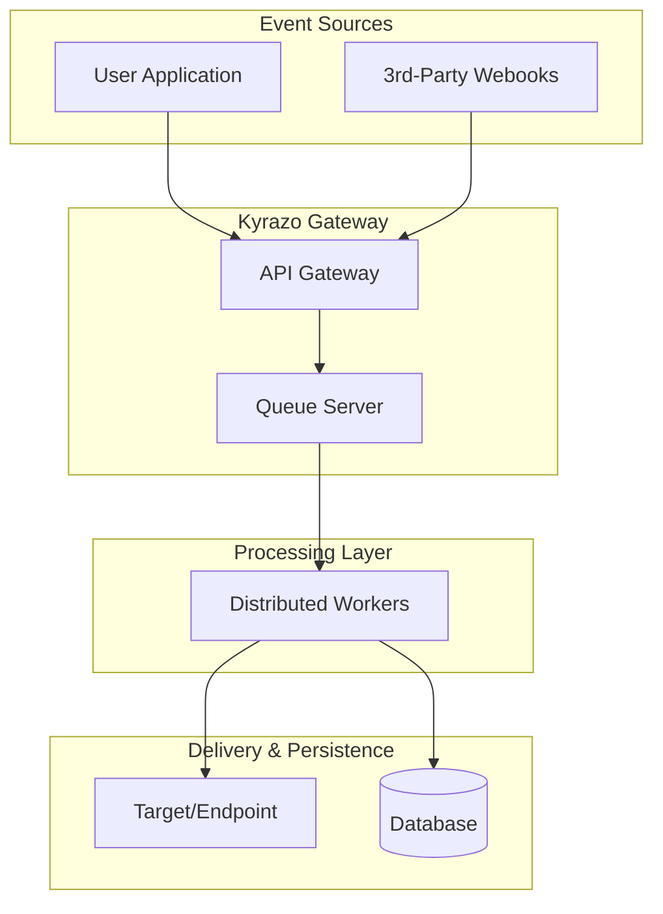

Kyrazo is built for reliability and scale. Its architecture is designed to decouple event ingestion from delivery, ensuring that your system remains responsive even during high-load periods or downstream failures.

## Event Lifecycle

The following diagram illustrates the journey of an event through the Kyrazo platform.

## System Components

### 1. Inbound Ingestion
Events enter Kyrazo from various sources. These can be direct API calls from your **User Application** (Dispatch) or incoming webhooks from **3rd-party services** like Stripe (Ingest).

### 2. API Gateway
The Gateway is the entry point. It performs immediate validation, checks rate limits, and ensures the request is authorized. Its primary goal is to accept the event as quickly as possible and acknowledge receipt to the producer.

### 3. Distributed Queueing
To ensure reliability, every accepted event is immediately placed into a **Distributed Queue server**. This decoupling allows Kyrazo to handle sudden bursts of traffic without losing data. The event is safely persisted in the queue until it is successfully processed.

### 4. Distributed Workers
A fleet of **Distributed Workers** pulls events from the queue concurrently. This horizontal scaling allows Kyrazo to process millions of events per hour. 

Workers are responsible for:
- **Routing**: Determining where the event needs to go based on your project configuration.
- **Processing**: Formatting the payload and preparing security signatures.
- **Dispatching**: Sending the event to its final destination in the background.

### 5. Delivery Modes

Kyrazo handles delivery based on the configured mode:

- **Dispatch**: The event is delivered to one or more configured **Targets** (webhook URLs).
- **Ingest**: If a source is mapped to an internal **Endpoint**, the event is routed there and the raw event data is stored for further processing.

### 6. Reliability & Persistence
Every delivery attempt is recorded in the **Database**. If a target is unavailable, the workers handle the retry logic automatically, ensuring that no event is dropped due to temporary network issues.
